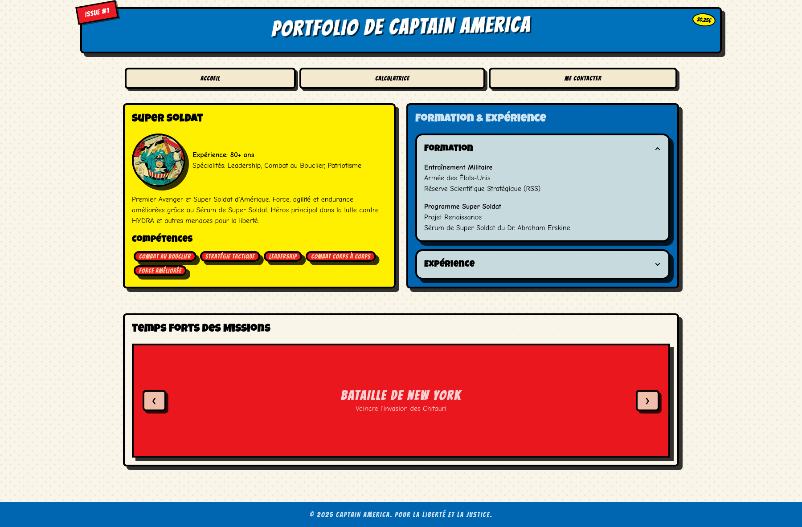

# Portfolio de Bande Dessinée

Un site web portfolio élégant sur le thème des bandes dessinées, construit avec Tailwind CSS et DaisyUI.



## Fonctionnalités

- Design inspiré des bandes dessinées avec des couleurs vibrantes et des éléments dynamiques
- Page CV/portfolio interactive présentant les compétences et l'expérience
- Calculatrice fonctionnelle avec un style bande dessinée
- Formulaire de contact accessible uniquement après avoir répondu correctement aux questions
- Bouton de piratage par force brute pour un accès direct à la page de contact
- Design entièrement responsive

## Structure du Projet

```
project/
├── node_modules/
├── src/
│   ├── css/
│   │   ├── input.css (Source Tailwind CSS)
│   │   └── output.css (CSS compilé)
│   ├── js/
│   │   └── main.js (Fonctionnalités JavaScript)
│   ├── static/
│   │   ├── data/
│   │   │   └── questions.json (Questions du quiz)
│   │   └── images/
│   ├── index.html (Page principale)
│   └── A1_2_A2_1_A3_2.html (Page de contact)
├── tailwind.config.js
└── package.json
```

## Instructions d'Installation

1. Clonez le dépôt ou téléchargez le code source.

2. Assurez-vous d'avoir [Node.js](https://nodejs.org/) installé.

3. Installez les dépendances:

   ```
   npm install
   ```

4. Compilez le CSS:

   ```
   npm run build:css
   ```

5. Lancez le site web:

   ```
   npm run serve
   ```

   Cela ouvrira automatiquement le site dans votre navigateur par défaut.

6. Pour le développement avec rechargement à chaud (surveillance des changements CSS):
   ```
   npm run dev
   ```
